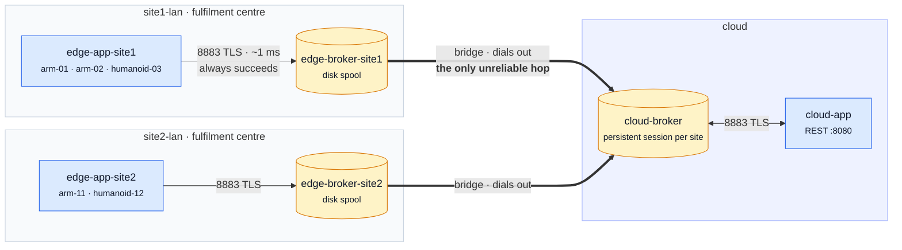
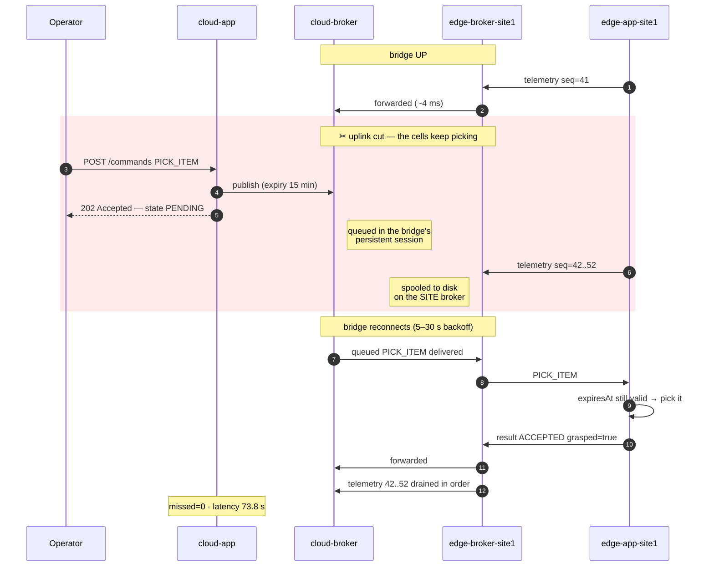
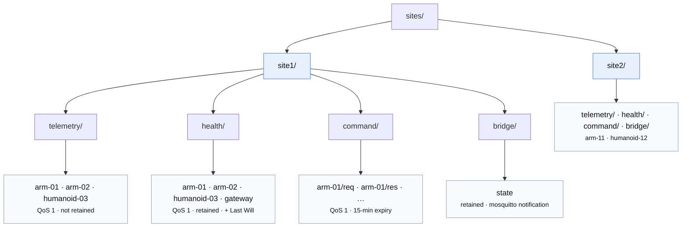

# Cloud ⇄ Edge MQTT demo — automated picking across sites

A production-shaped MQTT setup for a fleet of **robotic picking cells** — arms and
humanoids working the pick face at fulfilment centres on unreliable uplinks.

Two Spring Boot services, three Mosquitto brokers, two sites, five robots. TLS,
password auth, per-site ACLs, durable sessions and disk-backed queues throughout.
Everything runs from `docker compose`.

Architecture and rationale below; [**FEATURES.md**](FEATURES.md) is the full
catalogue of what is used and why.

---

## The problem this is built around

Sites are behind NAT on links that come and go — cellular, rural DSL, a shared
uplink that saturates every afternoon. Picking never stops when the link does: the
cells keep working, and the cloud has to catch up afterwards without losing a pick
or replaying a stale one.

Three kinds of traffic:

| Kind | Direction | Requirement |
|---|---|---|
| **Telemetry** — pick rate, grasp success, cycle time, joint temp, battery | edge → cloud | High rate. Must never be lost, however late it arrives: throughput and SLA reporting reconcile against it. |
| **Health** — cell mode, E-stop, battery | edge → cloud | Low rate. A new subscriber must learn the state of every cell immediately. |
| **Command** — `PICK_ITEM`, `PAUSE_PICKING`, `RESUME_PICKING` | cloud → edge | Must survive an outage, but must **not** execute if it arrives stale. |

That last row is the sharp one, and picking makes it concrete. A `PICK_ITEM` that
queued for three hours behind a dead uplink names an order that has been rerouted
and a bin that has been restocked with something else — running it puts the wrong
item in a tote that already shipped. A three-hour-old `RESUME_PICKING` restarts an
arm in a cell someone is standing in, because that is usually *why* it was paused.
Delivering those late is worse than not delivering them at all.

The naive design — every gateway opens an MQTT connection straight to the cloud
broker — puts the flaky link on the critical path of every publish. Each service
then grows its own retry loop, its own disk spool, its own backpressure handling,
and each one gets it slightly wrong.

## Why a bridge

**The edge app publishes to a broker on its own LAN. That publish is a loopback
call that always succeeds in single-digit milliseconds.** The WAN link is owned
entirely by the Mosquitto bridge between the site broker and the cloud broker.



Sites **dial out** — they are behind NAT with no stable address, so the cloud can
never initiate. Everything reaching a site rides a connection the site opened.


The bridge reconnects with backoff, holds a persistent session on the cloud side,
and spools to disk while the link is down. When connectivity returns it drains the
backlog in order at QoS 1.

**Neither application contains a single line of code about the unreliable link.**

`edge-app` is attached only to its own site network in `docker-compose.yml`, so it
*cannot* reach the cloud broker even by accident — the boundary is enforced by
Docker, not by convention.

---

## Quick start

```bash
cd mqtt
./scripts/bootstrap.sh          # generates CA, server certs, truststore, passwords
docker compose up -d --build
```

Wait ~45s for health checks, then:

```bash
curl -s localhost:8080/api/v1/fleet | jq
```

### See the whole point in one command

```bash
./scripts/demo.sh
```

It cuts site 1's uplink, issues a command to the unreachable site, waits, restores
the link, and shows the command executing and the telemetry backlog draining.

---

## The interesting part: an outage, by hand

```bash
./scripts/chaos.sh site1 down
```

This detaches **the site broker** from the `wan` network. The site LAN keeps
working; only the bridge notices.

```bash
# The site is fine. The cells are still picking at full rate.
curl -s localhost:8081/actuator/health | jq '.status'          # UP

# The cloud cannot see it.
curl -s localhost:8080/api/v1/fleet | jq '.[] | select(.site=="site1")'
#   status: "STALE"

# Send a pick anyway. HTTP 202: the cloud BROKER has it, durably.
curl -s -XPOST localhost:8080/api/v1/sites/site1/robots/arm-01/commands \
     -H 'Content-Type: application/json' \
     -d '{"type":"PICK_ITEM","parameters":{"sku":"SKU-88231","sourceBin":"B-14-03","targetTote":"T-9072"}}' | jq
#   state: "PENDING"
```

```bash
./scripts/chaos.sh site1 up     # ~5-30s later the bridge reconnects
```

Both directions during one outage, and why they behave differently:



Two different queues do the work, which is why the failure modes differ:
**telemetry** waits on the *site* broker's disk, **commands** wait in the *cloud*
broker's session for that site's bridge.

Measured on this stack, across a ~74-second outage:

```
  PICK_ITEM  state=ACCEPTED  endToEndLatencyMillis=73863
             result={"sku":"SKU-88231","grasped":"true","picksCompleted":"2"}
  arm-01     missed=0  backlogged=11  maxIngestLagMillis=80865
```

**`missed=0` is the headline: no pick data lost, only delayed** — and the pick
itself ran on arrival because it was still inside its 15-minute window.

Other chaos options:

```bash
./scripts/chaos.sh status                # which uplinks are up
./scripts/chaos.sh site1 flap 6 20 10    # 6 cycles of 20s down / 10s up
```

---

## Topic scheme — site first

```
sites/<site>/telemetry/<robot>        edge → cloud    QoS 1              high volume
sites/<site>/health/<robot>           edge → cloud    QoS 1, retained    + Last Will
sites/<site>/command/<robot>/req      cloud → edge    QoS 1              15-min expiry
sites/<site>/command/<robot>/res      edge → cloud    QoS 1              correlated by commandId
sites/<site>/bridge/state             broker → cloud  QoS 1, retained    mosquitto's own notification
```

**The site is the first segment because the site is the tenant boundary.** It is
what gets a credential, an ACL, a bridge and an uplink that fails independently of
every other site. Rooting the tree there means:

- *"this operator may read everything at site 1 and nothing anywhere else"* is a
  single ACL line — `topic read sites/site1/#` — instead of one line per message
  kind that has to be revisited every time a kind is added;
- a topic browser shows **one branch per site**, with that site's telemetry, health
  and commands underneath it, rather than scattering each site across a
  `telemetry/` branch, a `health/` branch and a `command/` branch;
- a new message kind (`alarm`, `config`) slots in under a site without changing the
  shape of anything above it.




The cost lands on fleet-wide reads: `sites/+/telemetry/+` rather than
`telemetry/+/+`. That is the right trade — four subscriptions in one service,
versus a tenant boundary enforced on every broker for every site. Optimise the
layout for the thing there is more of. (Sparkplug B orders its namespace the same
way: group id before message type.)

The `sites/` root leaves somewhere for genuinely fleet-wide topics to live that is
not inside any one tenant's subtree.

**Direction is encoded in the leaf, never inferred.** `req` and `res` are separate
topics, so the bridge carries them in opposite directions and the ACL grants read
on one and write on the other.

> One place the prefix deliberately does *not* collapse: the bridge credential
> cannot be granted `sites/site1/#` for write. It must write telemetry and health
> but only *read* commands — granting write on the whole subtree would let a site
> inject commands addressed to its own devices, bypassing the cloud and every
> authorisation check that lives there.

### Retained vs not — each choice is deliberate

| Topic | Retained | Why |
|---|---|---|
| `health/…` | **yes** | Heartbeats are 15s apart. Without retain, a restarted cloud service is blind to a device for a full interval, and "quiet" is indistinguishable from "never seen". |
| `telemetry/…` | no | A retained reading is delivered to every new subscriber and *looks like live data*. It isn't. |
| `command/…/req` | no | A retained `PICK_ITEM` would be re-delivered — and re-picked — by every future subscriber, including the site's own bridge after a reconnect. |
| `command/…/res` | no | A stale result replayed to a new subscriber is actively misleading. |

---

## Expiry policy: commands only

**Commands are the only thing in this system with a deadline.** They expire 15
minutes after being issued, enforced in two places:

- an **MQTT 5 Message Expiry Interval**, so the *cloud broker* drops the command
  from an offline site's queue and never spends bandwidth shipping it;
- `expiresAt` in the payload, re-checked by the edge on arrival — broker expiry is
  a delivery deadline and says nothing about how long the message then sat behind
  other work at the site.

A command that lapsed while queued comes back as `EXPIRED_UNDELIVERED`. One that
arrives after lapsing is answered `EXPIRED` and deliberately **not run**. Executing
a three-hour-old `RESUME_PICKING` because it was technically delivered is how
store-and-forward systems hurt people.

**Telemetry and health carry no expiry at all** — not on the message, and not via
session lifetime. A reading captured during a six-hour outage is the historical
record and must arrive whenever the link returns. Concretely:

- no Message Expiry Interval is set on those publishes;
- `persistent_client_expiration` is **unset** on every broker;
- both services connect with `session-expiry: 4294967295s` (the protocol maximum,
  i.e. never).

The cost of never expiring sessions is real: sessions for *decommissioned* sites
accumulate forever. In production that is handled by explicitly deleting a session
when a site is retired, not by a timer that cannot tell "retired" from "offline".
The queue caps in the broker configs bound the damage in the meantime.

---

## Durability, end to end

Every hop persists to disk. A message is only acknowledged once someone durable owns it.

| Hop | Mechanism |
|---|---|
| edge-app → site broker | Paho client store on a volume, QoS 1 — covers a crash between publish and ack (~1ms), *not* the outage buffer |
| edge-app session | `clean-start=false`, session expiry = never |
| site broker | `persistence true` on a volume, `max_queued_messages 100000` — **this is the store-and-forward buffer** |
| bridge → cloud | `cleansession false`, disk-backed queue, backoff `restart_timeout 5 30` |
| cloud broker | `persistence true` on a volume, no session expiry |
| cloud-app session | `clean-start=false`, session expiry = never |

QoS 1 (at-least-once) everywhere: QoS 0 loses data on exactly the link least able
to afford it, and QoS 2 costs two extra round trips on that same link. The price of
QoS 1 is duplicates, which is handled explicitly — see below.

### One real bug this design flushed out

The bridge runs **MQTT 3.1.1**, not 5, and that is deliberate:

> In MQTT 5 a session's lifetime is governed by the Session Expiry Interval on
> CONNECT, whose default is `0` — *delete my session the instant I disconnect*.
> Mosquitto's bridge has no config option to set that property, so a v5 bridge with
> `cleansession false` **still loses its session on every disconnect**: the cloud
> broker drops the bridge's subscription and silently discards anything queued for
> it.

The failure is nasty because it is **asymmetric**. Telemetry keeps working
perfectly — it is queued on the *edge* side, which is unaffected — so dashboards
stay green and nothing alerts. The only symptom is that commands issued during an
outage never arrive, which you notice hours later, from the business side, when a
pick that was accepted never happened.

This stack was built with `mqttv50` first and behaved exactly that way: telemetry
drained with `missed=0` while a queued `PICK_ITEM` sat `PENDING` forever. The
diagnosis needed a controlled experiment to separate two candidate causes — a
message written into a socket that was already dead, versus a session that no
longer existed. Waiting until the broker had *definitively* marked the bridge
offline before publishing, and seeing the command still lost, ruled out the first.

Confirmed in mosquitto 2.0.22's source rather than inferred from behaviour:

- `lib/send_connect.c:37` — the fourth parameter of `send__connect()` is the
  CONNECT property list.
- `src/bridge.c:326` and `:467` — the bridge passes `NULL` for it. No Session
  Expiry Interval is ever transmitted, so a v5 remote applies the spec default
  of `0`.
- `src/bridge.c:130` sets `session_expiry_interval = UINT32_MAX`, which looks like
  the fix but is not: it applies to the *local* context, never to the wire.

In 3.1.1 there is no expiry property to omit, and `cleansession false` means what
you want it to mean.

---

## At-least-once means duplicates

Acknowledgement is the hinge. The starter takes ack control from Paho and
acknowledges only **after** a listener returns cleanly (`mqtt.manual-acks=false`).
Paho's own auto-ack fires as soon as its callback returns — and because the client
hands work to a dispatch thread, that would acknowledge before the listener ran,
making QoS 1 at-least-once only as far as the library. A listener that throws is
not acknowledged, so the broker keeps the message and redelivers it.

That alone would trade one failure for another — a message that can *never* succeed
would be redelivered forever, holding an inflight slot until delivery stalls. So the
cloud service enables a **dead-letter topic** (`dlq/cloud-service`): after
`max-attempts` a failure is published there with its original topic, the error and
the payload, then acknowledged. The queue drains and the failure becomes an object
you can inspect in the topic browser and replay.

QoS 1 plus a bridge that replays on reconnect means a command **will** sometimes
arrive twice. `CommandExecutor` keeps a bounded LRU of recent `commandId`s; a
repeat is answered `DUPLICATE` and not re-executed.

Duplicate detection runs **before** expiry checking, deliberately: a redelivered
command that has since lapsed should be reported as the duplicate it is, not as a
confusing `EXPIRED` for something the cloud already holds an `ACCEPTED` for.

## Freshness is judged on capture time, never arrival

When a bridge reconnects it dumps hours of backlog in seconds. Every one of those
messages arrives *now*; almost none of them describe now. So `FleetRegistry`:

- keys staleness off `capturedAt`, stamped at the edge;
- rejects out-of-order and replayed messages by sequence number, so a redelivery
  cannot overwrite newer state with older readings;
- counts **sequence gaps** — QoS 1 tells you a message was delivered, only the
  sequence tells you one never was. In a fulfilment centre a gap is missing pick
  counts, which surfaces later as throughput that does not reconcile.

## Liveness: what a Last Will can and cannot do

A Last Will is a property of an MQTT *connection*, and a gateway holds one
connection on behalf of several devices. So the will covers the **gateway** only
(`health/<site>/gateway`), which flips to `DOWN` the moment the process dies.

Per-robot liveness has no such backstop and is inferred in the cloud from a missed
heartbeat (`STALE`). An explicit `DOWN` always beats the heuristic.

The will is **retained**, which matters: it has to *overwrite* the retained `UP`. A
non-retained will reaches whoever happens to be subscribed at that instant and then
vanishes, leaving the retained `UP` in place — so anyone subscribing later reads a
dead gateway as healthy.

---

## Topic browser UI

An off-the-shelf MQTT client — **MQTT Explorer**, web edition — is wired in under an
opt-in compose profile. It renders the live topic **tree**, which is what you
actually want when the question is *"what does site 1 publish?"*.

```bash
docker compose --profile ui up -d
open http://localhost:8090
```

All three brokers are **preseeded** by `scripts/bootstrap.sh` — Cloud, Site 1 and
Site 2 appear in the connection list with credentials already filled in. Pick one
and hit Connect:

```
cloud-broker
└── sites
    ├── site1
    │   ├── bridge     (1 topic)
    │   ├── health     (4 topics)   ← retained, so values are there immediately
    │   └── telemetry  (3 topics)
    └── site2
        └── …
```

Three deliberate choices:

- **A read-only `observer` account.** It can watch everything and publish nothing,
  so the debugging tool can never issue a command by accident, and its access can be
  revoked without touching either service.
- **Subscriptions at QoS 0.** An inspection tool must never make the broker queue
  messages on its behalf — it is there to watch the system, not become part of it.
- **It connects on port 1883**, the plaintext listener bound to the container
  networks and never published to the host. That listener exists precisely for local
  ops tooling; nothing crosses the WAN in clear text. MQTT Explorer proxies MQTT
  server-side over socket.io, so the browser needs neither a WebSocket listener on
  the brokers nor a copy of the private CA.

`mqtt-ui` is the only container attached to **all three networks**. That is the
point of an observation host: it stands in for someone with on-site access, so you
can keep watching a site's broker spool while its WAN uplink is cut.

### The most instructive thing to do with it

Open **Site 1 broker (on-site)** and **Cloud broker** side by side, then:

```bash
./scripts/chaos.sh site1 down
```

The site broker's tree keeps updating — sequence numbers climbing, health
refreshing. The cloud broker's `sites/site1` branch freezes. Restore the link and
the cloud catches up in one burst. That divergence *is* the bridge doing its job.

---

## Security

- **TLS** on every listener and every bridge, against a private CA generated by
  `scripts/bootstrap.sh`. Hostname verification is on; `bridge_insecure false`.
- **No anonymous access.** Every connection authenticates.
- **Per-site tenancy via ACLs.** Site 1's bridge credential is confined to
  `sites/site1/…`. A compromised site-1 gateway cannot publish telemetry as site 2 or
  read site 2's commands. The site-first topic layout is what makes that boundary a
  prefix rather than an enumeration.
- **A read-only `observer` account** for the topic browser, separate from either
  service.
- **Random passwords per install**, generated into `.env` and `secrets/`, both
  gitignored. Nothing in this repo contains a real credential.
- Containers run as a **non-root user** (uid 10001).

> The one concession to the demo: cert and password files are mounted world-readable,
> because Docker Desktop bind mounts preserve host uid/gid and Mosquitto drops to uid
> 1883. In production these are delivered by the secret store, owned by the broker
> user, mode 0600.

---

## HTTP API (cloud-service, port 8080)

```
GET  /api/v1/fleet                                  last-known state of every robot
GET  /api/v1/bridges                                WAN link state per site
POST /api/v1/sites/{site}/robots/{robot}/commands   issue a command  → 202 Accepted
GET  /api/v1/commands                               recent commands
GET  /api/v1/commands/{commandId}                   one command and its result
```

Commands: `PICK_ITEM` (`sku`, `sourceBin`, `targetTote`), `PAUSE_PICKING`,
`RESUME_PICKING`, `SET_TELEMETRY_INTERVAL`, `REPORT_HEALTH`, `PING`.

A pick sent to a paused cell is **refused, not queued** — `REJECTED: cell is
PAUSED; resume it before sending picks`. Holding it to run "later" is how you get a
surprise arm movement next to a person.

Command submission returns **202, not 200**, and that status code is the contract:
the cloud broker has durably accepted the command and nothing more is promised.
Whether the site is reachable right now is not knowable at that point, and an API
that blocked waiting for the device would just be a timeout generator.

Actuator on every service: `/actuator/health`, `/actuator/metrics`,
`/actuator/prometheus`.

Note the deliberate asymmetry in what "healthy" means: an edge service whose *site
uplink* is down is still `UP` — it is publishing locally and the bridge is spooling.
Only losing the *local* broker is an application-level outage.

---

## Layout

```
mqtt/
├── docker-compose.yml                topology, networks, health checks
├── broker/
│   ├── cloud/config/                 cloud broker conf + ACL
│   └── edge-site{1,2}/config/        site broker conf template (bridge) + ACL
├── apps/
│   ├── mqtt-spring-boot/             reusable MQTT plumbing (autoconfigure + starter)
│   ├── cloud-service/                Maven project + Dockerfile
│   └── edge-service/                 Maven project + Dockerfile
└── scripts/
    ├── bootstrap.sh                  PKI, credentials, rendered configs
    ├── chaos.sh                      WAN outage simulation
    └── demo.sh                       scripted end-to-end walkthrough
```

Each service is organised by domain rather than by layer:

| `…mqtt.edge` (gateway) | `…mqtt.cloud` (fleet) | `…mqtt.spring` (starter) |
|---|---|---|
| `robot/` — cell state, registry | `fleet/` — last-known state | `core/` — connection, gateway |
| `telemetry/` — sampling | `command/` — dispatch, results | `listener/` — `@MqttListener` scan |
| `health/` — heartbeat, LWT | `listener/` — subscriptions | `annotation/` — `@MqttListener` |
| `command/` — execution | `api/` — REST | `autoconfigure/` — wiring |
| `config/` — properties, will | `config/` — properties | `health/` — actuator indicator |
| `protocol/` — topics + payloads | `protocol/` — topics + payloads | `support/` — JSON codec |

Dependencies in the starter point one way — `autoconfigure` → everything,
`listener` → `core`+`support`+`annotation`, `core` → `support` — so nothing depends
on `autoconfigure` and the library can be wired by hand without Boot.

### What is shared, and what deliberately is not

The two services share **`mqtt-spring-boot-starter`** and nothing else. The line
between them is the point:

| | Shared? | Why |
|---|---|---|
| MQTT plumbing — connection, TLS, will, reconnect, health, metrics | **yes** | Infrastructure. Versioned independently and backward-compatibly; a starter upgrade never forces a coordinated release. |
| `Topics` and the payload records | **no** | The *wire contract*. Changing it means cloud and gateways must agree, and a shared jar hides that coupling behind a version bump. |

The services deploy on schedules that have nothing to do with each other — the cloud
rolls forward continuously, gateways are updated in maintenance windows over the very
links this design is about. Sharing the contract would turn every cloud release into
a fleet-wide release. Duplicating a page of constants is far cheaper than that.

**The contract of record is the topic scheme documented above, not a Java type.**
Each side keeps only what it uses: the edge has `commandRequestFilter`, the cloud has
the fleet-wide wildcards.

### The starter

[`apps/mqtt-spring-boot`](apps/mqtt-spring-boot/README.md) — annotate
to receive, inject a gateway to send:

```java
@MqttListener(topic = "sites/${app.edge.site-id}/command/+/req")
public void onCommand(CommandRequest request, String topic) { ... }
```

```java
gateway.send(topic, telemetry);                                 // no expiry, ever
gateway.send(topic, health, MqttSendOptions.retain());          // last-known state
gateway.send(topic, command, MqttSendOptions.expiringIn(ttl));  // 15-minute deadline
```

Listeners are discovered by a `BeanPostProcessor`, the same mechanism
`@KafkaListener` uses. That removed both hand-written `MqttSubscription`
configuration classes — including the `ObjectProvider` that existed purely to break
a cycle between the connection and the handler that needed it. Discovery happens
after every bean exists, so the cycle no longer arises.

---

## Ports

| Port | Service |
|---|---|
| 8080 | cloud-service HTTP |
| 8081 / 8082 | edge-service HTTP (site 1 / site 2) |
| 8883 | cloud broker MQTTS |
| 18883 / 28883 | site broker MQTTS (site 1 / site 2) |
| 8090 | MQTT Explorer UI (`--profile ui`) |

Watch traffic from your laptop:

```bash
source .env
mosquitto_sub -h localhost -p 8883 --cafile certs/ca.crt \
  -u observer -P "$OBSERVER_PASSWORD" -t 'sites/#' -v
```

## Tests

```bash
(cd apps/mqtt-spring-boot && mvn test)   # 50 — auto-config, listeners, acks, dead-letter, filters
(cd apps/cloud-service    && mvn test)   #  7 — replay, gaps, staleness, LWT
(cd apps/edge-service     && mvn test)   #  8 — expiry boundaries, topic scheme
```

The starter must be installed first (`mvn install`) for the services to resolve it;
the Dockerfiles do this automatically.

## Feature reference

[**FEATURES.md**](FEATURES.md) catalogues every feature in use — MQTT protocol,
Mosquitto directives, Paho APIs, delivery-semantics handling, security, Spring
Boot, concurrency, Docker — with where each is configured and why. It closes with
what was deliberately *not* used, and why.

## Teardown

```bash
docker compose down -v      # -v also drops the broker queues and client spools
```

Everything is namespaced under the compose project `jinternals-mqtt`: images
`jinternals/mqtt-{cloud,edge}-service:1.0.0`, networks `jinternals_{wan,site1,site2}`,
volumes `jinternals-mqtt_*`. `scripts/chaos.sh` detaches a site broker from
`jinternals_wan`, so that network name is the one thing the script depends on.
